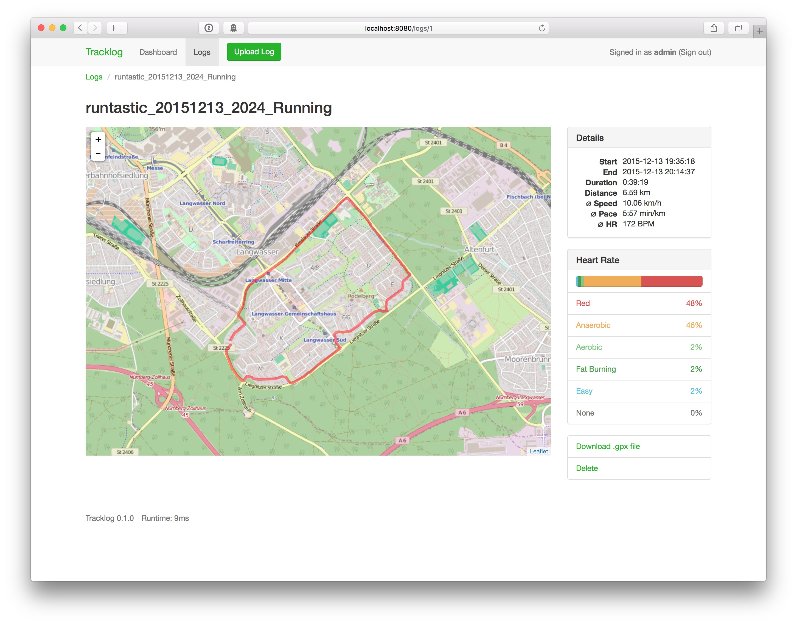

# Tracklog

**Tracklog** is a web application for managing GPX track files written in Go.

## Installation

First, make sure you have Go and Node.js installed.

To build the JavaScript and CSS assets, run:

    npm install
    npm run build

At the moment, Tracklog depends on version 2 of `github.com/thcyron/sqlbuilder`
which hasn’t been released yet, so you have to check out the v2 branch manually:

    git clone github.com/thcyron/sqlbuilder $GOPATH/src/github.com/thcyron
    (cd $GOPATH/src/github.com/thcyron/sqlbuilder && git checkout -t origin/v2)

Now, fetch dependency packages and build the command line programs:
    
    go get ./...
    (cd cmd/server && go build)
    (cd cmd/import && go build)

Create and initialize a new Postgres database, which will also create a new user
with both username and password set to *admin*:

    createdb tracklog
    psql tracklog < db/postgres.sql

Start the server and point your browser to http://localhost:8080/:

    cmd/server/server -config config.json

You can batch-import your GPX files with:

    cmd/import/import -config config.json -user admin /path/to/your/*.gpx

## License

Tracklog is licensed under the MIT license.
