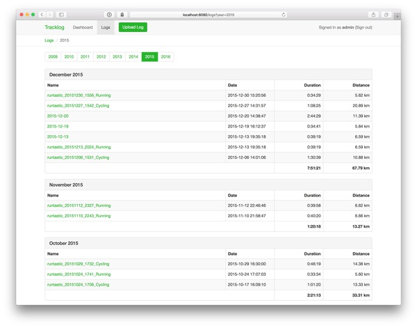
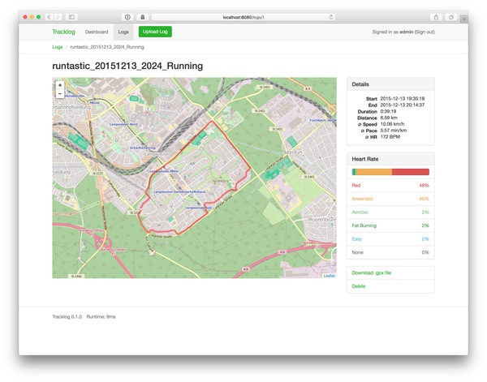

# Tracklog

**Tracklog** is a web application for managing GPX track files written in Go.

## Run Tracklog with Docker

There’s a Docker image [thcyron/tracklog](https://hub.docker.com/r/thcyron/tracklog)
for Tracklog. This image only contains the server and import binary, you have to
bring your own Postgres server. You also have to provide a config file.

    docker run -v /path/to/config.toml:/config.toml -p 8080:8080 thcyron/tracklog

Alternately, use docker-compose to run:

    docker-compose up -d
    docker exec -it tracklog /bin/tracklog-control -config /config.toml user add <name>

## Installation

First, make sure you have Go and Node.js installed.

To build the JavaScript and CSS assets, run:

    npm install
    npm run build

Now, build the command line programs:

    ./script/build

Create and initialize a new Postgres database:

    createdb tracklog
    psql tracklog < db/postgres.sql

Add a new user:

    cmd/control/control -config config.toml user add <name>

Start the server and point your browser to http://localhost:8080/:

    cmd/server/server -config config.toml

You can batch-import your GPX files with:

    cmd/control/control -config config.toml import -user <name> /path/to/your/*.gpx

## License

Tracklog is licensed under the MIT license.
